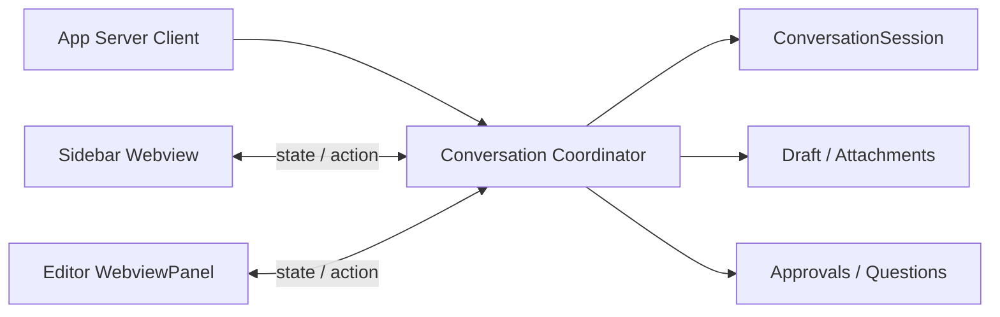

# エディタータブ会話対応 実装計画書

- 作成日: 2026-08-13
- 状態: Phase 4 の内部整理・自動検証・ユーザーによる見た目確認済み。Phase 3 の残手動確認は継続。
- 対象: 既存スレッドの会話画面
- 関連計画: `PLAN.md`

## 1. 目的

現在サイドバーで提供している既存スレッドの会話機能を、VS Code のエディタータブでも利用できるようにする。

エディタータブでは履歴閲覧だけでなく、発言送信、実行停止、ストリーミング表示、再同期、実行設定、追加入力、承認・質問への応答を行えることを最終目標とする。

## 2. 採用方針

初期実装では、1つの VS Code ウィンドウ内で操作可能な会話画面を1つに制限する。

- 会話画面の表示先は、サイドバーまたはエディタータブのいずれか一方とする。
- エディタータブで会話を開くと、サイドバーはスレッド一覧へ戻る。
- サイドバーで会話を開くと、操作対象だったエディタータブを閉じるか、非操作状態にせず表示先をサイドバーへ移す。
- 表示先の切り替えでは `ConversationSession` を作り直さない。
- 実行中のターン、ストリーミング状態、再同期状態、下書き、添付を同じセッションから引き継ぐ。
- 初期実装では複数の会話タブを同時に操作可能にしない。

この制限により、二重送信、Stop の競合、通知の二重適用、下書きや実行設定の競合を避ける。

## 3. 計画作成時の実装

以下は Phase 1 着手前の状態である。実装後の責務境界と検証結果は第12節に記録する。

### 3.1 サイドバー

サイドバーの `ThreadListWebviewProvider` が、次の責務を持っている。

- `ConversationSession` の生成、保持、破棄
- App Server 通知の会話セッションへの適用
- Send、Stop、Reload、再同期
- モデル、推論レベル、速度、権限設定
- 画像、ファイル Mention、Skill の添付
- ファイル・Skill サジェスト
- 承認、質問、フォームへの応答
- 下書きの保存と復元
- 使用量、コンテキスト残量、完了通知の管理
- Webview への会話状態配信

サイドバー用 Webview の `src/webview/threads/main.ts` は、会話本文に加えて Composer と各操作 UI を構築している。

### 3.2 エディタータブ

`ConversationPanelManager` は、次の読み取り専用機能を持っている。

- `thread/read` による履歴取得
- 会話本文と変更ファイル一覧の表示
- 変更ファイルおよび Codex 発言内のファイルリンクを開く処理
- Reload
- WebviewPanel の復元

エディタータブは `ConversationSession` を持たず、App Server の会話通知も受け取らない。Composer、Send、Stop、実行設定、追加入力、承認 UI は存在しない。

### 3.3 問題

会話セッションの所有権が `ThreadListWebviewProvider` に結び付いているため、エディタータブへ操作機能を単純に追加すると、次の問題が発生する。

- 同じスレッドに複数の `ConversationSession` が生成される可能性がある。
- App Server 通知をどちらの画面へ適用するか不明確になる。
- Send、Stop、Reload が競合する。
- 下書き、添付、実行設定、承認要求の状態が分岐する。
- サイドバーを閉じた状態で、エディタータブ側のセッション管理が成立しない。

## 4. 目標アーキテクチャ

会話セッションの所有権を Webview から分離し、拡張機能ホスト側の共通コーディネーターへ移す。

### 4.1 Conversation Coordinator

新しい共通コンポーネントは、少なくとも次を担当する。

- スレッドごとの `ConversationSession` の所有
- App Server 通知および Server Request の振り分け
- 現在の表示先の管理
- 表示先へ送る `ConversationScreenState` の生成
- Send、Stop、Reload、実行設定変更の受付
- 下書き、添付、サジェスト、承認要求の管理
- 表示先切り替え時の購読解除と再購読
- 実行中セッションのバックグラウンド追跡

`ThreadListWebviewProvider` と `ConversationPanelManager` は、画面固有のナビゲーションと Webview のライフサイクル管理に集中させる。

### 4.2 Webview UI の共通化

サイドバー用 `threads/main.ts` に直接実装されている会話 UI を、再利用可能な単位へ分離する。

- 会話本文
- Composer
- Send／Stop
- 実行設定
- 添付一覧と Add メニュー
- ファイル・Skill サジェスト
- 承認・質問・フォーム
- 使用量、コンテキスト残量、Latest 表示

サイドバーとエディタータブで同じ状態型と操作メッセージを使用し、画面固有の差分はヘッダー、戻る操作、サイズに応じた CSS に限定する。

### 4.3 表示先の切り替え

表示先切り替えは、セッションの移動ではなく購読先の変更として扱う。

1. 現在の Webview へ操作終了を通知する。
2. 現在の Webview から会話状態の購読を解除する。
3. 新しい Webview を表示する。
4. 同じ `ConversationSession` の最新スナップショットを新しい Webview へ送る。
5. 実行中の場合は、その後の通知を新しい Webview だけへ配信する。

切り替え中に届いた通知はコーディネーターがセッションへ適用し、Webview の有無に依存させない。

## 5. ユーザーフロー

### 5.1 エディタータブで開く

1. スレッド一覧の行またはコンテキストメニューから「エディターで開く」を選択する。
2. サイドバーで会話を表示中の場合は一覧へ戻る。
3. 対象スレッドのエディタータブを開く。既に開いている場合は再利用する。
4. 下書き、添付、実行状態を引き継いで表示する。
5. エディタータブから Send、Stop、Reload などを操作できる。

### 5.2 サイドバーへ戻す

1. エディタータブの「サイドバーで開く」を選択するか、スレッド一覧から対象スレッドを選択する。
2. エディタータブの会話操作を無効化して閉じる。
3. サイドバーへ同じセッションの最新状態を表示する。
4. 入力途中の下書きと添付を引き継ぐ。

### 5.3 実行中の切り替え

- ターンを停止しない。
- 新しい `thread/resume` や `turn/start` を発行しない。
- ストリーミング通知をコーディネーターが継続して適用する。
- 切り替え後の画面に最新状態を表示する。

### 5.4 エディタータブを閉じる

- 実行中のターンを自動停止しない。
- 下書きと添付を保持する。
- サイドバーは一覧表示のままとする。
- 対象スレッドを再度開いたときに最新状態を復元する。

## 6. 実装フェーズ

### Phase 1: セッション所有権の分離

目的は、表示を変えずに会話セッションを Webview Provider から独立させることである。

- `ConversationCoordinator` を追加する。
- `ConversationSession`、下書き、添付、承認要求、通知処理を段階的に移す。
- App Server の通知と Server Request をコーディネーターへ渡す。
- サイドバーはコーディネーターを経由して状態取得と操作を行う。
- 現在のサイドバー UX とプロトコル上の動作を維持する。

受け入れ条件:

- 既存のサイドバー機能に動作差分がない。
- Send、Stop、Reload、再同期の既存テストが通る。
- サイドバー Webview が非表示でも実行中セッションへ通知を適用できる。
- 同じスレッドに重複した `ConversationSession` を生成しない。

### Phase 2: 共通会話 UI と基本的なエディター操作

- Composer と操作ボタンを共通モジュールへ分離する。
- エディタータブへ Composer、Send、Stop、Reload を追加する。
- 会話スナップショットとストリーミング更新をエディタータブへ配信する。
- 「エディターで開く」「サイドバーで開く」の導線を追加する。
- 排他的な表示先切り替えを実装する。
- 実行中の表示先切り替えをテストする。

受け入れ条件:

- エディタータブから既存スレッドへ発言できる。
- 実行中の回答がエディタータブへストリーミング表示される。
- Stop 後も履歴が不整合にならず、次の発言を送信できる。
- サイドバーとエディタータブから同時に操作できない。
- 表示先切り替えでターンや下書きを失わない。

### Phase 3: サイドバーとの機能同等化

以下の機能は Phase 2 の UI 共通化で接続済み。Phase 3 では表示先を往復した際の動作を検証し、差異や不具合を修正する。実施結果と未検証項目は14章に記録する。

- モデル、推論レベル、速度、権限設定を追加する。
- 画像、ファイル Mention、Skill を追加する。
- ファイル・Skill サジェストを追加する。
- 承認、質問、フォームへの応答を追加する。
- 使用量、コンテキスト残量、Latest、ブックマークを確認する。
- 画面幅に応じたエディタータブ用レイアウトを調整する。

受け入れ条件:

- サイドバーで可能な既存スレッド操作をエディタータブでも実行できる。
- 承認要求は現在の表示先だけに表示され、1回だけ応答できる。
- 添付と実行設定が表示先切り替え後も一致する。
- ファイルリンク、変更ファイル、コピー、ブックマークが両画面で動作する。

### Phase 4: 整理と将来拡張

- 旧読み取り専用パネル専用コードを削除または共通実装へ統合する。
- 重複したプロトコル型と CSS を整理する。
- WebviewPanel の復元時に、排他制約とセッション再同期を適用する。
- 将来、複数会話タブを同時に操作可能にする場合の拡張点を記録する。

## 7. テスト計画

### 7.1 単体テスト

- 表示先の排他制御
- 同一スレッドのセッション再利用
- 表示先切り替え時の購読解除と再購読
- 下書き、添付、実行設定の維持
- Send／Stop の競合防止
- 不正または古い Webview メッセージの拒否
- パネル復元時の状態検証

### 7.2 統合テスト

- サイドバーからエディタータブへ切り替えて発言する。
- ストリーミング中に表示先を切り替える。
- Stop 直後に表示先を切り替え、その後に再送信する。
- Reload／再同期中に古い結果を破棄する。
- 承認要求の表示先を切り替え、重複応答を防止する。
- App Server 再接続後に現在の表示先へ状態を復元する。

### 7.3 手動確認

- Windows、WSL、macOS でサイドバーとエディタータブを往復する。
- 狭いサイドバーと広いエディター領域でレイアウトを確認する。
- 長い回答、コードブロック、ネストしたリスト、ファイルリンクを確認する。
- 実行中、完了、失敗、中断、承認待ちの各状態を確認する。

## 8. 主なリスクと対策

### 8.1 セッションの二重生成

コーディネーターを唯一の生成元とし、スレッド ID ごとに既存セッションを再利用する。

### 8.2 通知の欠落または二重適用

通知は Webview ではなくコーディネーターへ配送する。Webview は正規化済みスナップショットだけを受け取る。

### 8.3 表示先切り替え中の競合

表示世代または購読 ID を持ち、古い Webview からの操作と古い非同期結果を拒否する。

### 8.4 既存サイドバー機能の退行

Phase 1 では UI を変更せず、既存テストを Characterization Test として維持する。責務移動と新 UI を同じ PR に混在させない。

### 8.5 Webview 実装のコピー

`threads/main.ts` の Composer 実装をエディター側へ複製しない。共通モジュールへ分離してから利用する。

## 9. 初期対象外

- 複数の会話タブを同時に操作する機能
- サイドバーとエディタータブの同時操作
- 同じスレッドを複数の VS Code ウィンドウで同期する機能
- エディタータブごとに独立したモデル設定や下書きを持つ機能
- 新規スレッドをエディタータブから作成する機能
- 会話タブの分割表示間でリアルタイム同期する機能

## 10. 実装開始前に確定する項目

1. 排他単位を「VS Code ウィンドウ内の全会話で1画面」とするか、「スレッドごとに1画面」とするか。
2. サイドバーへ切り替える際、エディタータブを閉じるか、読み取り専用で残すか。
3. エディタータブを閉じた際、サイドバーへ自動表示するか一覧のままとするか。
4. Phase 2 の時点で実行設定を含めるか、Phase 3 までサイドバーで設定した値を使用するか。
5. エディタータブの復元時に自動で操作画面へ戻すか、ユーザー操作を要求するか。

## 11. 推奨する最初の作業

最初の PR では UI を追加せず、次だけを行う。

1. `ThreadListWebviewProvider` の会話セッション関連テストを分類する。
2. セッション、通知、操作、下書きの責務境界を定義する。
3. `ConversationCoordinator` を追加する。
4. サイドバーをコーディネーター経由へ切り替える。
5. 既存の受け入れ条件とテストが変わらないことを確認する。

この段階を独立させることで、エディター UI の追加とセッション所有権の変更を同時に行わず、回帰時の原因を限定できる。

## 12. Phase 1 実装記録（2026-09-10）

### 12.1 責務境界

| コンポーネント | 責務 |
| --- | --- |
| `ConversationCoordinator` | セッションの生成・再利用・破棄、通知と Server Request の受付、Send／Stop／Reload／再同期、下書き・添付・実行設定・サジェスト・承認応答、会話状態と完了通知の生成。 |
| `ConversationPresentation` / `ConversationViewConnection` | 状態配信、可視状態、未読件数を画面へ接続する。接続の破棄は表示の購読だけを解除し、セッションを破棄しない。置き換えられた接続からの操作・破棄を無視する。 |
| `ThreadListWebviewProvider` | Webview の生成・破棄、HTML／CSP、受信メッセージの検証、復元情報・可視状態の受け渡し、サイドバーのバッジ表示。 |
| `extension.ts` | コーディネーターを拡張機能の寿命で保持し、App Server の通知・要求・接続状態、リポジトリの更新を直接渡す。 |

既存の動作を維持するため、会話の選択や復元に必要な一覧スナップショットと既存の `threads/*` メッセージは共通側でも引き続き利用する。エディター側への接続と共通 UI・プロトコルの整理は Phase 2 以降で行う。

### 12.2 テストの分類と追加検証

| 分類 | 対象・検証内容 |
| --- | --- |
| サイドバーの既存動作 | `threadListWebviewProvider.test.ts` の既存31件を維持。履歴と一覧の遷移、Send／Stop、通知の再生、再接続、Reload の古い結果、下書き・添付・サジェスト、新規作成、ブックマーク、ファイルリンク、完了バッジ、フォーカスを確認する。 |
| セッション内部・プロトコル | `conversationSession.test.ts`、`conversationReducer.test.ts`、`conversationInteraction.test.ts`、`threadsProtocol.test.ts` および App Server 統合テストを維持する。 |
| 画面に依存しない所有権 | 新規 `conversationCoordinator.test.ts` の5件で、非表示中のストリーミングと完了、再表示時の再利用、下書き・添付・設定の維持、古い接続の拒否、承認の一度だけの応答、古い履歴結果の破棄、終了時の保留送信無効化を確認する。 |
| Provider の寿命 | サイドバーのテストを1件追加。Provider 自体を破棄・再生成しても同一セッションへ通知を適用し、再読込せずに再表示できることを確認する。 |

既存のサジェスト選択テストで、ファイル I/O の完了を `setImmediate` 2回だけで待っていた箇所を、対応する選択結果メッセージの待機へ変更した。

検証結果:

- `npm test`: 189件中184件成功、5件スキップ、失敗なし。
- `npm run build`、`npm run typecheck:test`、`npm run lint`: 成功。

- `npm run verify:package-files`: 必須6アセットを確認。
- テストとパッケージ内容検証は、サンドボックス内で子プロセス起動が `EPERM` となるため、当該コマンドに限定した権限で実施した。
- VS Code Extension Host テストおよび各 OS での手動確認は未実施。

### 12.3 Phase 1 完了時点の次の作業

Phase 2 として共通会話 UI を抽出し、エディタータブへ Composer／Send／Stop／Reload と状態配信を接続する。画面間の導線、実行中の排他的切り替え、エディターからサイドバーへの復帰は未実装であり、今回の変更だけではエディタータブから発言できない。

## 13. Phase 2 実装記録（2026-09-12）

### 13.1 実装内容

- サイドバーの会話 UI を `src/webview/conversation/application.ts` へ移し、両画面のエントリーポイントから共有する。Composer、Send／Stop／Reload、ストリーミング描画に加え、既存の実行設定・添付・承認 UI も同じ実装を利用する。
- 一覧の **↗（Open in editor）** と会話ヘッダーの **⋯ → Open in editor** からエディターへ移動し、**⋯ → Open in sidebar** からサイドバーへ戻る導線を追加した。
- コーディネーターはサイドバーの一覧表示への接続を維持しつつ、会話操作と会話状態配信を現在の表示先に限定する。サイドバーを遅れて表示・再生成しても、エディターの会話を奪わない。
- エディターのパネル管理を共通セッションへ接続した。同じスレッドのタブは再利用し、別の会話タブを開くと前のタブを閉じる。サイドバーへ戻る場合もエディターを閉じる。
- タブを閉じても実行を停止せず、セッション・下書き・添付を保持する。送信や Reload の途中でも表示先を変更でき、切り替えだけでは追加の `thread/resume`／`turn/start` を発行しない。
- 送信完了は送信時点の下書きと添付だけを消去し、移動先で新たに書いた文章を保持する。非同期のサイドバー表示要求が遅れて完了しても、新しい画面選択を上書きしない。
- エディター用の背景色・最大幅・狭幅時の余白を追加し、入力フォーカスのショートカットも現在の会話画面へ向けた。

### 13.2 採用した初期仕様

| 項目 | Phase 2 の仕様 |
| --- | --- |
| 排他単位 | VS Code ウィンドウ内の全会話で1操作画面。 |
| サイドバーへ戻る際 | エディタータブを閉じる。 |
| エディタータブを閉じる際 | ターンは停止せず、サイドバーは一覧のまま。 |
| 実行設定 | 共通 UI の既存設定を両画面で利用する。 |
| タブ復元 | 有効な保存状態から自動復元する。複数の保存タブがある場合は最初の1つを操作画面として復元する。 |

### 13.3 検証結果

- `npm test`: 201件中196件成功、5件スキップ、失敗なし。
- 追加テストでは、ストリーミング中の往復、古い画面の操作拒否、一覧更新の継続、サイドバーの遅延生成、送信中の下書き保持、Stop 後の再送信、Reload 中の切り替え、遅れた画面遷移の拒否を確認した。
- パネルの再利用、別スレッドのタブとの排他、閉じた後の通知反映、サイドバーへ戻る際のパネル破棄、複数タブ復元時の排他も確認した。
- `npm run build`、`npm run typecheck:test`、`npm run lint`、`git diff --check`: 成功。
- `npm run verify:package-files`: 必須6アセットを確認。
- 既存サジェストテストに残っていたファイル I/O 待機2箇所を、対応する結果メッセージの待機へ変更した。
- VS Code Extension Host テストと実画面の手動確認は未実施。ローカルの VS Code 実行ファイルには `libnss3.so`、`libnspr4.so`、`libasound.so.2` などの共有ライブラリが不足している。

### 13.4 残作業

Phase 3 では共有された実行設定・画像・Mention・Skill・サジェスト・承認・質問・使用量・ブックマークについて、両画面を往復する操作と各 OS／テーマ／画面幅での実画面確認を進める。旧読み取り専用メッセージ型の整理などは Phase 4 に残す。新規スレッドの作成は引き続きサイドバーから行う。

### 13.5 利用時のフィードバックへの対応

- ユーザーによってエディター／サイドバーの切り替えと下書きの保持が確認された。
- タイトルの表示幅を確保するため、ヘッダーの切り替えボタンを幅24pxの **⋯** メニューへ移した。外側クリックと Escape で閉じ、Escape ではメニューボタンへフォーカスを戻す。
- エディターの入力欄に一瞬だけフォーカスした後に外れるとの報告を受け、ショートカット実行時の不要な `reveal()` を除去した。Webview に既にフォーカスがある場合は直接入力欄へ移し、それ以外はタブを表示した後の Webview フォーカス通知を待つ。表示処理と入力欄フォーカスの競合を避ける構成とした。
- フォーカス処理の回帰テストを2件追加し、全203件中198件成功、5件スキップを確認した。型チェック・lint・ビルドも成功。ユーザーによってメニューと入力フォーカスのショートカットの動作が確認された。
- 追加のフィードバックを受け、Reload も **⋯** メニュー内へ移した。選択時はメニューを閉じ、メニューボタンへフォーカスを戻す。この移動後の実画面確認は未実施。
- Reload のショートカットは別ブランチで対応する。未着手の作業として [全体計画の18.1](PLAN.md#181-会話-reload-と表示先トグルのショートカット) に記録した。

## 14. Phase 3 対応記録（2026-09-12）

作業ブランチ: `feature/editor-tab-conversation-phase3`（Phase 2 の `63ad352` から分岐）。

### 14.1 修正内容

- 画像・Mention・Skill の選択中に表示先を変更すると、選択結果が古い画面からの結果と判定されて破棄されていた。既存会話では、選択開始時と同じ会話セッションが現在も表示されていれば移動先へ添付を反映するようにした。新規下書きの世代チェック、会話を離れた場合の破棄、実行中の操作制限は維持する。
- ブックマークの保存完了前に表示先を変更すると、移動先へ保存結果が配信されない場合があった。同じ会話セッションを表示している場合は、現在の画面へ最新状態を配信するようにした。保存中の重複操作は引き続き抑止する。
- 上記2点は修正前のテストで再現し、修正後の成功を確認した。

### 14.2 自動検証

- 画像・Mention・Skill の非同期選択結果をエディターへ反映し、サイドバーへ戻っても保持する。添付のローカルパスを Webview へ公開しない。
- 会話を離れた後やコーディネーター破棄後は、遅れて完了した選択結果を反映しない。
- ブックマーク保存中に切り替えても完了後の表示が更新され、重複保存が発生しない。
- 実行設定を往復後も保持し、次のエディターからの送信でモデル・推論レベル・速度・権限設定を使用する。
- 承認・質問・MCP フォームを往復後の画面から1回だけ応答する。非操作画面からの応答は拒否する。
- 古い画面の Skill 検索結果を破棄し、エディターで再検索・選択した添付をサイドバーへ引き継ぐ。
- コンテキスト残量を往復後も保持し、使用量通知を現在の会話画面へ配信する。
- `npm test`: 全214件中209件成功、5件スキップ、失敗なし。Phase 3 で11件追加。
- `npm run build`、`npm run typecheck:test`、`npm run lint`: 成功。

追加検証（必要ライブラリのインストール後）:

- `xvfb-run -a npm run test:vscode`: 成功（VS Code 1.92.2、終了コード0）。拡張機能の起動、コマンド登録、manifest と既定設定を確認した。
- サンドボックス内では Chromium のプロセス起動が `Operation not permitted`／`SIGTRAP` で失敗したため、同じコマンドを実行制限外で再試行して成功した。
- この Extension Host テストは会話画面の描画やキーボード操作を検証するものではない。

### 14.3 実画面での残確認

ユーザーが必要ライブラリと Xvfb をインストールし、共有ライブラリ不足は解消した。Extension Host テストも成功した。その後、ユーザーが拡張機能をインストールし、画面幅を変更してもレイアウトが良好であることを確認した。確認した OS・テーマ・具体的な幅は未記録。Phase 3 の受け入れ完了には次の確認が必要。

- Windows／WSL／macOS、ライト／ダーク／高コントラスト、狭いエディターグループでの表示。レイアウトの変更要否は実画面で判断する。
- 両画面で画像・Mention・Skill の追加／削除と `@`／`$` サジェストのキーボード操作・IME 入力。
- 承認・質問・フォームの操作、使用量ポップアップ、Latest、ブックマーク移動、コピー、ファイルリンク、変更ファイルを開く操作。
- **⋯ → Reload** の操作と、切り替え後の入力フォーカス。

これらは [手動確認手順](docs/TESTING.md#phase-3-presentation-parity) に沿って確認する。旧プロトコル整理は Phase 4、Reload ショートカットは別ブランチの作業として扱う。

## 15. Phase 4 対応記録（2026-09-12）

作業ブランチ: `feature/editor-tab-conversation-phase4`（Phase 3 の `21e6309` から分岐）。

### 15.1 整理内容

- 未使用となった旧読み取り専用パネルの `conversation/*` メッセージ型と検証関数を削除した。保存済みタブの version 1 データと検証関数は `src/webview/conversation/state.ts` に分離し、復元互換性を維持する。
- 両画面で使用するメッセージ型・検証関数を `src/webview/protocol.ts` へ移した。既存の `threads/*` メッセージ名と検証内容は維持し、ホスト・Webview・テストの参照先を統一した。
- 画面共通の CSS を `src/webview/application.css` へ移し、両画面で使う会話メニューのスタイルも集約した。`conversation/editor.css` はエディター固有の背景・幅・余白だけを担当する。
- `conversation/styles.css` から旧パネル専用のヘッダー・再読込ボタン用スタイルと、共通 CSS に上書きされていた余白・フォント定義を削除した。会話本文の描画・高コントラストの定義は維持する。
- `conversationErrorMessage` を `src/conversation/conversationError.ts` へ分離し、コーディネーターからパネル管理への依存を除去した。

### 15.2 復元と検証

- 既存の復元処理に追加実装は不要だった。複数の保存タブから1つだけ復元し、Webview の ready 通知後に履歴取得とセッションの resume をそれぞれ1回実行することを既存テストへ追加した。
- 旧プロトコル専用のテストを削除し、共通プロトコルが旧メッセージを拒否するテストへ置き換えた。保存データ検証のテストは `conversationState.test.ts` として維持する。
- `npm test`: 全214件中209件成功、5件スキップ、失敗なし。
- ビルド、ホスト・Webview・テストの型チェック、lint、差分の空白チェックに成功。
- `xvfb-run -a npm run test:vscode`: VS Code 1.92.2 の Extension Host テスト成功、終了コード0。
- `npm run verify:package-files`: 必須6アセットを確認。
- ユーザーが CSS 整理後の実画面を確認し、見た目に問題がないことを確認した。確認した OS・テーマ・具体的な幅は未記録。

### 15.3 将来、複数会話タブを扱う場合の変更箇所

現在は引き続き「VS Code ウィンドウ内で会話を操作する画面は1つ」とする。複数タブ機能自体は実装しない。

| 対象 | 将来検討する変更 |
| --- | --- |
| `ConversationPanelManager` | 単一の `managed` パネルをスレッド／パネル単位で管理する。同一スレッドの複数表示を許可するか、復元時にどのタブを有効にするかを先に決める。 |
| `ConversationCoordinator` | 表示先の登録とアクティブ画面・セッションの単一管理を見直す。通知の配信先と操作権限を各接続へ明示的に結び付け、古い接続からの操作拒否を維持する。 |
| セッション・下書き | 既存のスレッド単位のキャッシュを利用し、同じ会話の送信・停止・添付変更・承認応答を複数画面が競合して実行しないよう制御する。 |
| フォーカス・未読 | キーボードフォーカスのある会話をショートカットの対象にする。表示中・フォーカス中・読了の判定をタブごとに定義する。 |
| 保存と復元 | version 1 のスレッド参照は引き続き利用できる。追加情報が必要な場合だけ保存形式を更新し、古い形式からの復元を検証する。 |

Phase 3 の未確認項目は14.3節を参照。Reload ショートカットは全体計画18.1の独立した作業として残す。
