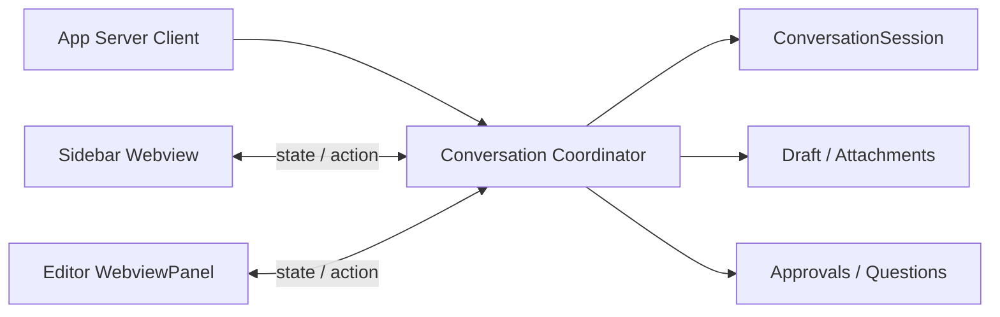

# エディタータブ会話対応 実装計画書

- 作成日: 2026-08-13
- 状態: Phase 1 実装済み（自動検証済み、手動確認未実施）
- 対象: 既存スレッドの会話画面
- 関連計画: `PLAN.md`

## 1. 目的

現在サイドバーで提供している既存スレッドの会話機能を、VS Code のエディタータブでも利用できるようにする。

エディタータブでは履歴閲覧だけでなく、発言送信、実行停止、ストリーミング表示、再同期、実行設定、追加入力、承認・質問への応答を行えることを最終目標とする。

## 2. 採用方針

初期実装では、1つの VS Code ウィンドウ内で操作可能な会話画面を1つに制限する。

- 会話画面の表示先は、サイドバーまたはエディタータブのいずれか一方とする。
- エディタータブで会話を開くと、サイドバーはスレッド一覧へ戻る。
- サイドバーで会話を開くと、操作対象だったエディタータブを閉じるか、非操作状態にせず表示先をサイドバーへ移す。
- 表示先の切り替えでは `ConversationSession` を作り直さない。
- 実行中のターン、ストリーミング状態、再同期状態、下書き、添付を同じセッションから引き継ぐ。
- 初期実装では複数の会話タブを同時に操作可能にしない。

この制限により、二重送信、Stop の競合、通知の二重適用、下書きや実行設定の競合を避ける。

## 3. 計画作成時の実装

以下は Phase 1 着手前の状態である。実装後の責務境界と検証結果は第12節に記録する。

### 3.1 サイドバー

サイドバーの `ThreadListWebviewProvider` が、次の責務を持っている。

- `ConversationSession` の生成、保持、破棄
- App Server 通知の会話セッションへの適用
- Send、Stop、Reload、再同期
- モデル、推論レベル、速度、権限設定
- 画像、ファイル Mention、Skill の添付
- ファイル・Skill サジェスト
- 承認、質問、フォームへの応答
- 下書きの保存と復元
- 使用量、コンテキスト残量、完了通知の管理
- Webview への会話状態配信

サイドバー用 Webview の `src/webview/threads/main.ts` は、会話本文に加えて Composer と各操作 UI を構築している。

### 3.2 エディタータブ

`ConversationPanelManager` は、次の読み取り専用機能を持っている。

- `thread/read` による履歴取得
- 会話本文と変更ファイル一覧の表示
- 変更ファイルおよび Codex 発言内のファイルリンクを開く処理
- Reload
- WebviewPanel の復元

エディタータブは `ConversationSession` を持たず、App Server の会話通知も受け取らない。Composer、Send、Stop、実行設定、追加入力、承認 UI は存在しない。

### 3.3 問題

会話セッションの所有権が `ThreadListWebviewProvider` に結び付いているため、エディタータブへ操作機能を単純に追加すると、次の問題が発生する。

- 同じスレッドに複数の `ConversationSession` が生成される可能性がある。
- App Server 通知をどちらの画面へ適用するか不明確になる。
- Send、Stop、Reload が競合する。
- 下書き、添付、実行設定、承認要求の状態が分岐する。
- サイドバーを閉じた状態で、エディタータブ側のセッション管理が成立しない。

## 4. 目標アーキテクチャ

会話セッションの所有権を Webview から分離し、拡張機能ホスト側の共通コーディネーターへ移す。

### 4.1 Conversation Coordinator

新しい共通コンポーネントは、少なくとも次を担当する。

- スレッドごとの `ConversationSession` の所有
- App Server 通知および Server Request の振り分け
- 現在の表示先の管理
- 表示先へ送る `ConversationScreenState` の生成
- Send、Stop、Reload、実行設定変更の受付
- 下書き、添付、サジェスト、承認要求の管理
- 表示先切り替え時の購読解除と再購読
- 実行中セッションのバックグラウンド追跡

`ThreadListWebviewProvider` と `ConversationPanelManager` は、画面固有のナビゲーションと Webview のライフサイクル管理に集中させる。

### 4.2 Webview UI の共通化

サイドバー用 `threads/main.ts` に直接実装されている会話 UI を、再利用可能な単位へ分離する。

- 会話本文
- Composer
- Send／Stop
- 実行設定
- 添付一覧と Add メニュー
- ファイル・Skill サジェスト
- 承認・質問・フォーム
- 使用量、コンテキスト残量、Latest 表示

サイドバーとエディタータブで同じ状態型と操作メッセージを使用し、画面固有の差分はヘッダー、戻る操作、サイズに応じた CSS に限定する。

### 4.3 表示先の切り替え

表示先切り替えは、セッションの移動ではなく購読先の変更として扱う。

1. 現在の Webview へ操作終了を通知する。
2. 現在の Webview から会話状態の購読を解除する。
3. 新しい Webview を表示する。
4. 同じ `ConversationSession` の最新スナップショットを新しい Webview へ送る。
5. 実行中の場合は、その後の通知を新しい Webview だけへ配信する。

切り替え中に届いた通知はコーディネーターがセッションへ適用し、Webview の有無に依存させない。

## 5. ユーザーフロー

### 5.1 エディタータブで開く

1. スレッド一覧の行またはコンテキストメニューから「エディターで開く」を選択する。
2. サイドバーで会話を表示中の場合は一覧へ戻る。
3. 対象スレッドのエディタータブを開く。既に開いている場合は再利用する。
4. 下書き、添付、実行状態を引き継いで表示する。
5. エディタータブから Send、Stop、Reload などを操作できる。

### 5.2 サイドバーへ戻す

1. エディタータブの「サイドバーで開く」を選択するか、スレッド一覧から対象スレッドを選択する。
2. エディタータブの会話操作を無効化して閉じる。
3. サイドバーへ同じセッションの最新状態を表示する。
4. 入力途中の下書きと添付を引き継ぐ。

### 5.3 実行中の切り替え

- ターンを停止しない。
- 新しい `thread/resume` や `turn/start` を発行しない。
- ストリーミング通知をコーディネーターが継続して適用する。
- 切り替え後の画面に最新状態を表示する。

### 5.4 エディタータブを閉じる

- 実行中のターンを自動停止しない。
- 下書きと添付を保持する。
- サイドバーは一覧表示のままとする。
- 対象スレッドを再度開いたときに最新状態を復元する。

## 6. 実装フェーズ

### Phase 1: セッション所有権の分離

目的は、表示を変えずに会話セッションを Webview Provider から独立させることである。

- `ConversationCoordinator` を追加する。
- `ConversationSession`、下書き、添付、承認要求、通知処理を段階的に移す。
- App Server の通知と Server Request をコーディネーターへ渡す。
- サイドバーはコーディネーターを経由して状態取得と操作を行う。
- 現在のサイドバー UX とプロトコル上の動作を維持する。

受け入れ条件:

- 既存のサイドバー機能に動作差分がない。
- Send、Stop、Reload、再同期の既存テストが通る。
- サイドバー Webview が非表示でも実行中セッションへ通知を適用できる。
- 同じスレッドに重複した `ConversationSession` を生成しない。

### Phase 2: 共通会話 UI と基本的なエディター操作

- Composer と操作ボタンを共通モジュールへ分離する。
- エディタータブへ Composer、Send、Stop、Reload を追加する。
- 会話スナップショットとストリーミング更新をエディタータブへ配信する。
- 「エディターで開く」「サイドバーで開く」の導線を追加する。
- 排他的な表示先切り替えを実装する。
- 実行中の表示先切り替えをテストする。

受け入れ条件:

- エディタータブから既存スレッドへ発言できる。
- 実行中の回答がエディタータブへストリーミング表示される。
- Stop 後も履歴が不整合にならず、次の発言を送信できる。
- サイドバーとエディタータブから同時に操作できない。
- 表示先切り替えでターンや下書きを失わない。

### Phase 3: サイドバーとの機能同等化

- モデル、推論レベル、速度、権限設定を追加する。
- 画像、ファイル Mention、Skill を追加する。
- ファイル・Skill サジェストを追加する。
- 承認、質問、フォームへの応答を追加する。
- 使用量、コンテキスト残量、Latest、ブックマークを確認する。
- 画面幅に応じたエディタータブ用レイアウトを調整する。

受け入れ条件:

- サイドバーで可能な既存スレッド操作をエディタータブでも実行できる。
- 承認要求は現在の表示先だけに表示され、1回だけ応答できる。
- 添付と実行設定が表示先切り替え後も一致する。
- ファイルリンク、変更ファイル、コピー、ブックマークが両画面で動作する。

### Phase 4: 整理と将来拡張

- 旧読み取り専用パネル専用コードを削除または共通実装へ統合する。
- 重複したプロトコル型と CSS を整理する。
- WebviewPanel の復元時に、排他制約とセッション再同期を適用する。
- 将来、複数会話タブを同時に操作可能にする場合の拡張点を記録する。

## 7. テスト計画

### 7.1 単体テスト

- 表示先の排他制御
- 同一スレッドのセッション再利用
- 表示先切り替え時の購読解除と再購読
- 下書き、添付、実行設定の維持
- Send／Stop の競合防止
- 不正または古い Webview メッセージの拒否
- パネル復元時の状態検証

### 7.2 統合テスト

- サイドバーからエディタータブへ切り替えて発言する。
- ストリーミング中に表示先を切り替える。
- Stop 直後に表示先を切り替え、その後に再送信する。
- Reload／再同期中に古い結果を破棄する。
- 承認要求の表示先を切り替え、重複応答を防止する。
- App Server 再接続後に現在の表示先へ状態を復元する。

### 7.3 手動確認

- Windows、WSL、macOS でサイドバーとエディタータブを往復する。
- 狭いサイドバーと広いエディター領域でレイアウトを確認する。
- 長い回答、コードブロック、ネストしたリスト、ファイルリンクを確認する。
- 実行中、完了、失敗、中断、承認待ちの各状態を確認する。

## 8. 主なリスクと対策

### 8.1 セッションの二重生成

コーディネーターを唯一の生成元とし、スレッド ID ごとに既存セッションを再利用する。

### 8.2 通知の欠落または二重適用

通知は Webview ではなくコーディネーターへ配送する。Webview は正規化済みスナップショットだけを受け取る。

### 8.3 表示先切り替え中の競合

表示世代または購読 ID を持ち、古い Webview からの操作と古い非同期結果を拒否する。

### 8.4 既存サイドバー機能の退行

Phase 1 では UI を変更せず、既存テストを Characterization Test として維持する。責務移動と新 UI を同じ PR に混在させない。

### 8.5 Webview 実装のコピー

`threads/main.ts` の Composer 実装をエディター側へ複製しない。共通モジュールへ分離してから利用する。

## 9. 初期対象外

- 複数の会話タブを同時に操作する機能
- サイドバーとエディタータブの同時操作
- 同じスレッドを複数の VS Code ウィンドウで同期する機能
- エディタータブごとに独立したモデル設定や下書きを持つ機能
- 新規スレッドをエディタータブから作成する機能
- 会話タブの分割表示間でリアルタイム同期する機能

## 10. 実装開始前に確定する項目

1. 排他単位を「VS Code ウィンドウ内の全会話で1画面」とするか、「スレッドごとに1画面」とするか。
2. サイドバーへ切り替える際、エディタータブを閉じるか、読み取り専用で残すか。
3. エディタータブを閉じた際、サイドバーへ自動表示するか一覧のままとするか。
4. Phase 2 の時点で実行設定を含めるか、Phase 3 までサイドバーで設定した値を使用するか。
5. エディタータブの復元時に自動で操作画面へ戻すか、ユーザー操作を要求するか。

## 11. 推奨する最初の作業

最初の PR では UI を追加せず、次だけを行う。

1. `ThreadListWebviewProvider` の会話セッション関連テストを分類する。
2. セッション、通知、操作、下書きの責務境界を定義する。
3. `ConversationCoordinator` を追加する。
4. サイドバーをコーディネーター経由へ切り替える。
5. 既存の受け入れ条件とテストが変わらないことを確認する。

この段階を独立させることで、エディター UI の追加とセッション所有権の変更を同時に行わず、回帰時の原因を限定できる。

## 12. Phase 1 実装記録（2026-09-10）

### 12.1 責務境界

| コンポーネント | 責務 |
| --- | --- |
| `ConversationCoordinator` | セッションの生成・再利用・破棄、通知と Server Request の受付、Send／Stop／Reload／再同期、下書き・添付・実行設定・サジェスト・承認応答、会話状態と完了通知の生成。 |
| `ConversationPresentation` / `ConversationViewConnection` | 状態配信、可視状態、未読件数を画面へ接続する。接続の破棄は表示の購読だけを解除し、セッションを破棄しない。置き換えられた接続からの操作・破棄を無視する。 |
| `ThreadListWebviewProvider` | Webview の生成・破棄、HTML／CSP、受信メッセージの検証、復元情報・可視状態の受け渡し、サイドバーのバッジ表示。 |
| `extension.ts` | コーディネーターを拡張機能の寿命で保持し、App Server の通知・要求・接続状態、リポジトリの更新を直接渡す。 |

既存の動作を維持するため、会話の選択や復元に必要な一覧スナップショットと既存の `threads/*` メッセージは共通側でも引き続き利用する。エディター側への接続と共通 UI・プロトコルの整理は Phase 2 以降で行う。

### 12.2 テストの分類と追加検証

| 分類 | 対象・検証内容 |
| --- | --- |
| サイドバーの既存動作 | `threadListWebviewProvider.test.ts` の既存31件を維持。履歴と一覧の遷移、Send／Stop、通知の再生、再接続、Reload の古い結果、下書き・添付・サジェスト、新規作成、ブックマーク、ファイルリンク、完了バッジ、フォーカスを確認する。 |
| セッション内部・プロトコル | `conversationSession.test.ts`、`conversationReducer.test.ts`、`conversationInteraction.test.ts`、`threadsProtocol.test.ts` および App Server 統合テストを維持する。 |
| 画面に依存しない所有権 | 新規 `conversationCoordinator.test.ts` の5件で、非表示中のストリーミングと完了、再表示時の再利用、下書き・添付・設定の維持、古い接続の拒否、承認の一度だけの応答、古い履歴結果の破棄、終了時の保留送信無効化を確認する。 |
| Provider の寿命 | サイドバーのテストを1件追加。Provider 自体を破棄・再生成しても同一セッションへ通知を適用し、再読込せずに再表示できることを確認する。 |

既存のサジェスト選択テストで、ファイル I/O の完了を `setImmediate` 2回だけで待っていた箇所を、対応する選択結果メッセージの待機へ変更した。

検証結果:

- `npm test`: 189件中184件成功、5件スキップ、失敗なし。
- `npm run build`、`npm run typecheck:test`、`npm run lint`: 成功。
- `npm run verify:package-files`: 必須6アセットを確認。
- テストとパッケージ内容検証は、サンドボックス内で子プロセス起動が `EPERM` となるため、当該コマンドに限定した権限で実施した。
- VS Code Extension Host テストおよび各 OS での手動確認は未実施。

### 12.3 次の作業

Phase 2 として共通会話 UI を抽出し、エディタータブへ Composer／Send／Stop／Reload と状態配信を接続する。画面間の導線、実行中の排他的切り替え、エディターからサイドバーへの復帰は未実装であり、今回の変更だけではエディタータブから発言できない。
